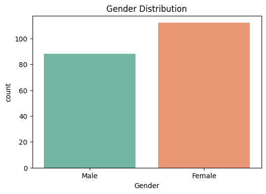
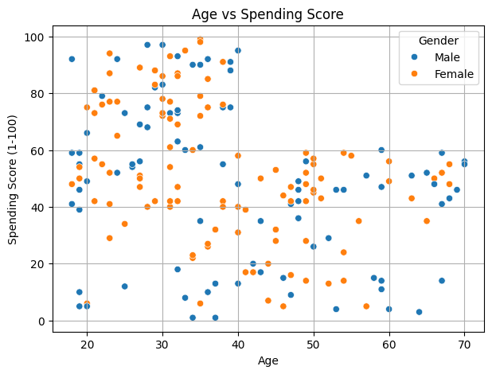
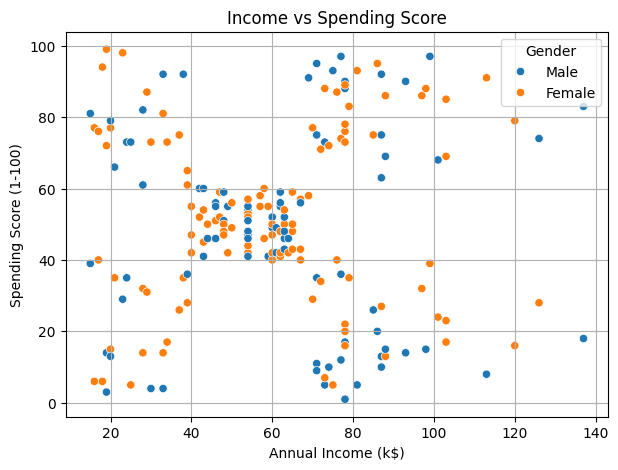
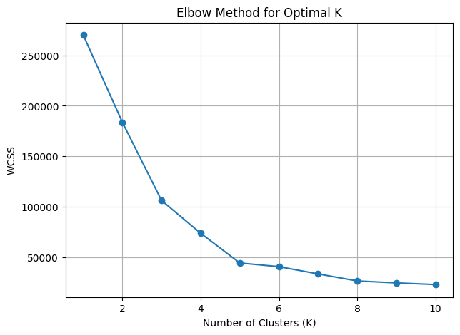
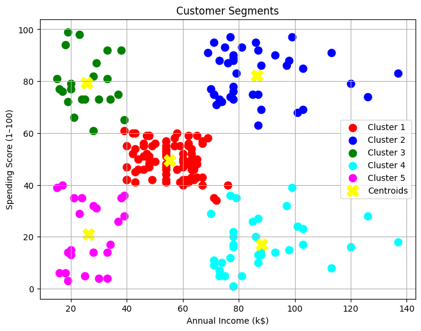
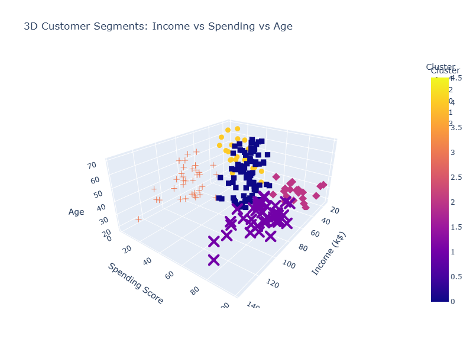

# 🎯 Customer Segmentation with K-Means Clustering

This project is part of my Elevvo 30-Day Machine Learning Challenge.  
The goal is to segment mall customers into meaningful groups based on income, age, and spending behavior using **K-Means Clustering**.

---

## 📊 Dataset

- Source: Mall Customers Dataset
- 200 records with features:  
  `CustomerID`, `Gender`, `Age`, `Annual Income (k$)`, `Spending Score (1-100)`

---

## 🧠 Tools Used

`Python`, `Pandas`, `Matplotlib`, `Seaborn`, `Scikit-learn`, `Plotly`

---

## 🔍 Objective

- Group customers based on spending behavior and income
- Use Elbow Method to find optimal number of clusters
- Visualize customer segments
- Bonus: Interactive 3D plot

---

## 📈 Visual Explorations

### 🔹 Gender Distribution

### 🔹 Age vs Spending

### 🔹 Income vs Spending

---

## 📌 Elbow Method – Optimal K
Used WCSS to determine best number of clusters:

→ Optimal number of clusters = **5**

---

## 🧪 Final Clusters (2D View)

Customers were segmented into 5 distinct clusters:

---

## 📋 Cluster Interpretation

| Cluster | Income 💰 | Spending 💸 | Description                     |
|---------|-----------|--------------|---------------------------------|
| 0       | Average    | Average       | Balanced segment  
| 1       | High       | High          | Premium customers 💎  
| 2       | Low        | High          | Value seekers (Risky)  
| 3       | High       | Low           | Cautious high-earners  
| 4       | Low        | Low           | Low-value segment  

---

## 🎁 Bonus: 3D Interactive Plot

A bonus interactive visualization was created using Plotly to show segments by:
- `Age`
- `Annual Income`
- `Spending Score`

---

## ✅ Status

✔️ Completed  
🔜 Next Project: [To be added after Task 3]

---

> Learning by building. Segment by segment. Challenge by challenge.

#MachineLearning #Clustering #CustomerSegmentation #KMeans #Python #Elevvo #Plotly #Portfolio
